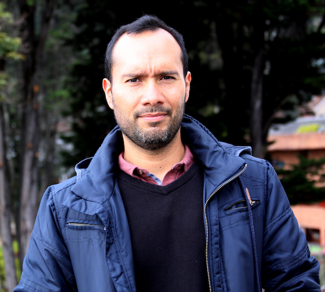

 
 <table style="width:100%">
<tr>
<td tyle="width:40%" style="text-align:left">
```{r out.width="300 px", echo=FALSE}

```
</td>
<td> 
Welcome to my website! I am a condensed matter physicist with a passion for experimental research. My work focuses on exploring the magnetic properties of complex oxides through proximity effects. By studying their magnetism dynamics and transport properties, I aim to uncover novel phenomena and contribute to the development of new technologies. As an associate professor of physics at Universidad de los Andes in Bogotá, Colombia, I am dedicated to sharing my knowledge and expertise with the next generation of scientists. Check out my research on nano-magnetism, nanoscience, and quantum phenomena by following the link below.

[https://nanomag.uniandes.edu.co](https://nanomag.uniandes.edu.co).

</td>
</tr>
<tr>
<td style="width:40%" style="text-align:left">
  <p></p>
  Dr. Juan Gabriel Ramírez <br>
  Associate Professor of Physics <br>
  [Universidad de los Andes](https://uniandes.edu.co) <br>
  [Department of Physics](https://fisica.uniandes.edu.co) <br>
  Office: IP 303, <br>
  Phone: +571 339-4949 Ext 3608 <br>
  Cra 1 # 18A - 12 <br>
  Bogotá 111711, Colombia <br>
  email:jgramirez at uniandes.edu.co <br>

  Google Scholar: [http://goo.gl/5VxePI](http://goo.gl/5VxePI) <br>
  Lab page: [http://nanomag.uniandes.edu.co](http://nanomag.uniandes.edu.co) <br>
     
</td>
<td>
</td>
  </tr>
  <tr>
    <td>
    </td>
    <td>
    </td>
  </tr>
</table>

